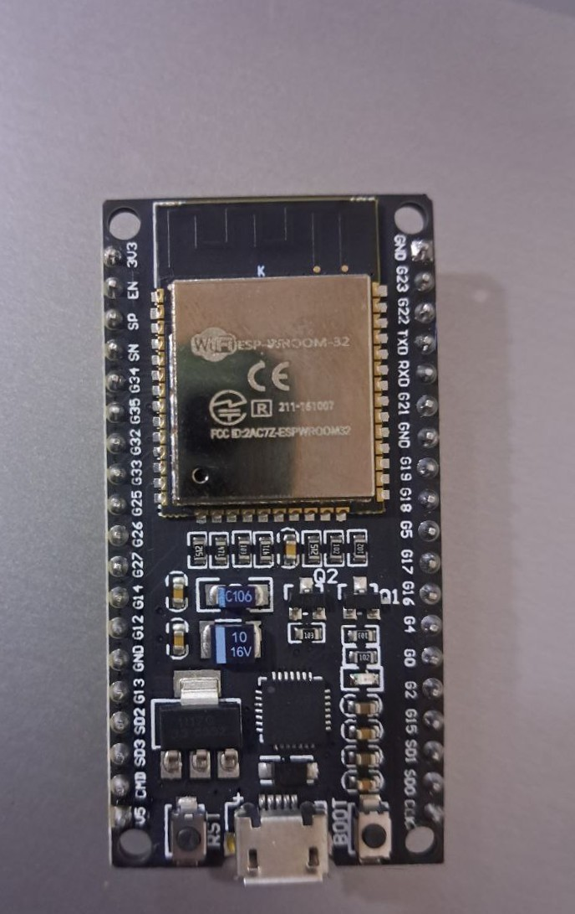
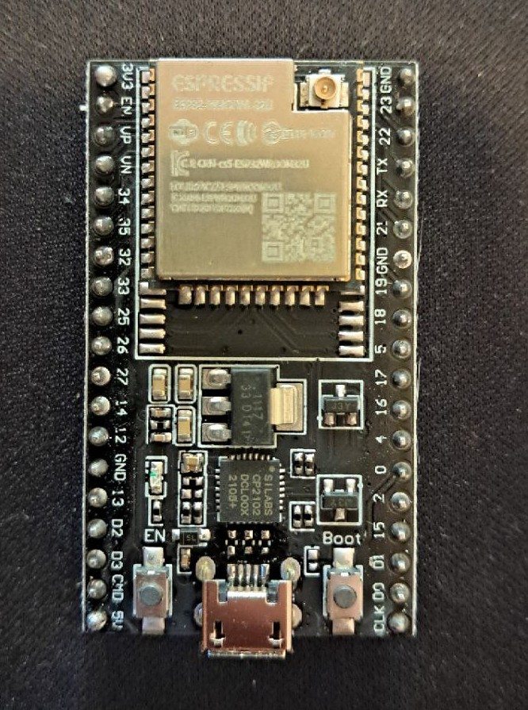
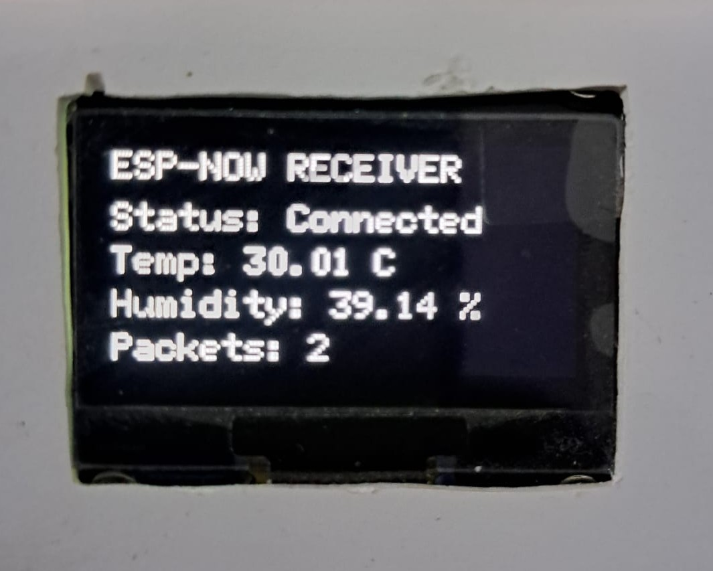
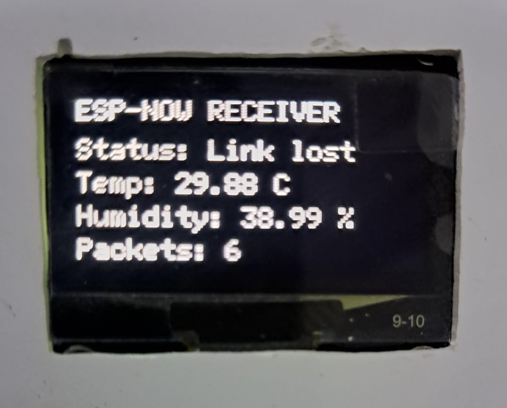
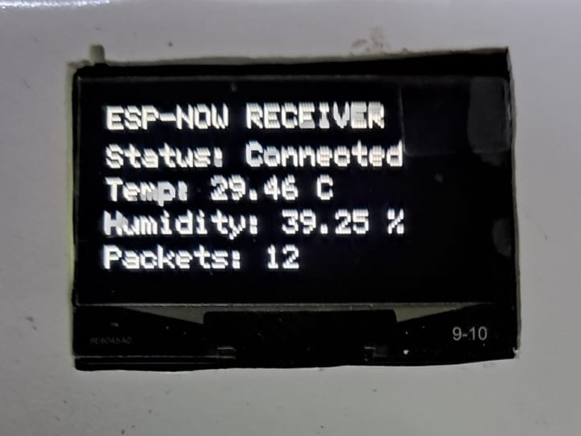

# ESP32 Dual-Node Telemetry

A two-node ESP32 project that sends temperature and humidity readings from an SHT31 sensor to a receiver board using ESP-NOW.

The transmitter node reads the SHT31 sensor and sends the measurements wirelessly. 
The receiver node displays the latest readings and connection status on an SH1106 OLED screen while also printing the received data to Serial Monitor.

The project was built and tested using physical ESP32 boards and sensor modules. It is intended as a practical example of short-range wireless telemetry between embedded nodes.

## System Overview

```text
SHT31 Sensor
     │
     ▼
Transmitter ESP32
     │
     │  ESP-NOW
     ▼
Receiver ESP32
     │
     ├── SH1106 OLED display
     └── Serial Monitor
```

The transmitter sends:

- packet number;
- temperature in degrees Celsius;
- relative humidity.

The receiver:

- displays the latest measurements;
- counts received packets;
- shows whether the wireless link is active;
- reports a lost connection when no packet is received for five seconds;
- resumes normal operation automatically when the transmitter becomes available again.

## Project Objectives

This repository was created to:

- demonstrate ESP-NOW communication between two ESP32 boards;
- transmit environmental measurements without connecting to a Wi-Fi router;
- display received data on an OLED screen;
- detect temporary communication loss;
- verify automatic connection recovery;
- document practical hardware tests and troubleshooting steps.

## Hardware Used

### Transmitter Node

- ESP32 development board
- SHT31 temperature and humidity sensor
- USB data cable
- jumper wires

### Receiver Node

- ESP32 development board
- SH1106 128 × 64 OLED display
- USB data cable
- jumper wires

## Software Environment

The project was developed and tested using:

```text
Arduino IDE: 2.3.7
Board: ESP32 Dev Module
ESP32 board package: esp32 by Espressif Systems 3.3.4
Serial baud rate: 115200
ESP-NOW channel: 9
USB interface: Silicon Labs CP210x
```

## Repository Structure

```text
ESP32 Dual-Node Telemetry/
├── docs/
│   └── troubleshooting.md
├── firmware/
│   ├── transmitter_node/
│   │   └── transmitter_node.ino
│   ├── receiver_node/
│   │   └── receiver_node.ino
│   ├── diagnostics/
│   │   └── sht31_transmitter_diagnostic/
│   │       └── sht31_transmitter_diagnostic.ino
│   └── tools/
│       └── read_esp32_mac_address/
│           └── read_esp32_mac_address.ino
├── images/
│   ├── esp32/
│   │   ├── receiver_node_esp32_board.jpg
│   │   └── transmitter_node_esp32_board.jpg
│   ├── oled/
│   │   ├── oled_module.jpeg
│   │   ├── oled_module_1.jpeg
│   │   ├── receiver_connected.jpeg
│   │   ├── receiver_link_lost.jpeg
│   │   └── receiver_connection_restored.jpeg
│   └── sht31/
│       ├── sht31_module.jpeg
│       └── sht31_module_1.png
├── results/
│   ├── diagnostics/
│   │   ├── sht31_diagnostic_test_pass.txt
│   │   └── sht31_disconnected_test.txt
│   └── telemetry/
│       └── connection_loss_and_recovery_test_pass.txt
├── .gitignore
├── LICENSE
└── README.md
```

## Firmware

### Transmitter Node

The transmitter reads temperature and relative humidity from the SHT31 sensor and sends a telemetry packet every 1.5 seconds.

Each packet contains:

- a sequential packet number;
- temperature in degrees Celsius;
- relative humidity.

The transmitter also reports whether each packet was delivered successfully.

### Receiver Node

The receiver listens for incoming ESP-NOW packets and displays the latest data on the OLED screen.

Before receiving the first packet, the display shows:

```text
Status: Waiting
```

During normal communication, it shows the temperature, humidity, and total number of received packets.

If no packet is received for five seconds, the status changes to:

```text
Status: Link lost
```

Communication resumes automatically when the transmitter becomes available again.

### SHT31 Diagnostic

The diagnostic sketch checks whether the SHT31 sensor can be detected and whether valid temperature and humidity readings can be collected before testing wireless communication.

Both a connected-sensor test and an intentional disconnection test are documented in the `results/diagnostics` directory.

## Receiver MAC Address

ESP-NOW unicast communication requires the transmitter to know the Wi-Fi station MAC address of the receiver ESP32.

The MAC address in `transmitter_node.ino` belongs to the receiver board used during testing. Before uploading the transmitter sketch, replace it with the MAC address of your own receiver ESP32.

The following utility is included to display the required address:

```text
firmware/tools/read_esp32_mac_address/read_esp32_mac_address.ino
```

Upload the utility to the receiver ESP32 and open Serial Monitor at `115200` baud. It will display an address similar to:

```text
AA:BB:CC:DD:EE:FF
```

Convert it to the format used in the transmitter sketch:

```cpp
uint8_t receiverMac[] = {
  0xAA, 0xBB, 0xCC, 0xDD, 0xEE, 0xFF
};
```

Both nodes must also use the same ESP-NOW channel.

## Wiring

### Transmitter Node

Connect the SHT31 sensor to the transmitter ESP32 using the default I2C pins:

| SHT31 Pin | ESP32 Pin |
|---|---|
| VIN | 3.3V |
| GND | GND |
| SDA | GPIO 21 |
| SCL | GPIO 22 |

### Receiver Node

Connect the SH1106 OLED display to the receiver ESP32:

| OLED Pin | ESP32 Pin |
|---|---|
| VCC | 3.3V |
| GND | GND |
| SDA | GPIO 21 |
| SCL | GPIO 22 |

> Check the pin labels printed on your sensor and OLED modules before applying power, because module layouts may differ between manufacturers.

## Required Libraries

The following libraries are used:

- `WiFi.h`
- `esp_wifi.h`
- `esp_now.h`
- `Wire.h`
- Adafruit SHT31 Library
- U8g2 Library

The ESP-NOW and Wi-Fi headers are included with the ESP32 board package. The Adafruit SHT31 and U8g2 libraries can be installed through the Arduino IDE Library Manager.

## Running the Project

### 1. Prepare the Arduino IDE

Install:

- the ESP32 board package by Espressif Systems;
- the Adafruit SHT31 Library;
- the U8g2 Library.

Select:

```text
Tools → Board → ESP32 Arduino → ESP32 Dev Module
```

Set Serial Monitor to:

```text
115200 baud
```

### 2. Read the Receiver MAC Address

Upload:

```text
firmware/tools/read_esp32_mac_address/read_esp32_mac_address.ino
```

to the receiver ESP32.

Open Serial Monitor and copy the displayed Wi-Fi station MAC address.

### 3. Configure the Transmitter

Open:

```text
firmware/transmitter_node/transmitter_node.ino
```

Replace the existing value in the `receiverMac` array with the MAC address of your receiver ESP32.

For example:

```cpp
uint8_t receiverMac[] = {
  0xAA, 0xBB, 0xCC, 0xDD, 0xEE, 0xFF
};
```

Make sure that the transmitter and receiver use the same ESP-NOW channel.

### 4. Upload the Receiver Sketch

Upload:

```text
firmware/receiver_node/receiver_node.ino
```

to the receiver ESP32.

The OLED should initially display:

```text
Status: Waiting
```

### 5. Upload the Transmitter Sketch

Upload:

```text
firmware/transmitter_node/transmitter_node.ino
```

to the transmitter ESP32.

When communication begins, the receiver OLED should display the temperature, humidity, packet count, and connection status.

The transmitter Serial Monitor should also report whether each telemetry packet was delivered successfully.

## Testing and Results

The project was tested using two physical ESP32 development boards. The tests covered sensor detection, telemetry delivery, connection-loss detection, and automatic recovery.

| Test | Expected Behavior | Observed Result |
|---|---|---|
| SHT31 connected | The transmitter detects the sensor and reads valid temperature and humidity values. | Passed |
| SHT31 disconnected | The diagnostic sketch reports that the sensor cannot be detected. | Passed |
| Normal telemetry | The transmitter sends packets and the receiver displays the received measurements. | Passed |
| Transmitter powered off | The receiver reports a lost connection after five seconds without incoming packets. | Passed |
| Transmitter powered on again | Communication resumes automatically without restarting the receiver. | Passed |

During the recovery test, the transmitter packet number restarted from `1` because the transmitter board had been rebooted. The receiver remained active and continued counting the packets it received.

### Test Logs

Detailed test outputs are available in:

- [`SHT31 diagnostic test`](results/diagnostics/sht31_diagnostic_test_pass.txt)
- [`SHT31 disconnected test`](results/diagnostics/sht31_disconnected_test.txt)
- [`Connection loss and recovery test`](results/telemetry/connection_loss_and_recovery_test_pass.txt)

The MAC addresses in the published test logs are masked as:

```text
XX:XX:XX:XX:XX:XX
```

## Hardware Test Images

### ESP32 Nodes

| Receiver Node | Transmitter Node |
|---|---|
|  |  |

### Receiver Display States

| Connected | Link Lost | Connection Restored |
|---|---|---|
|  |  |  |

The display changes from the normal connected state to `Link lost` when incoming telemetry stops. It returns to the connected state automatically after the transmitter begins sending packets again.

## Troubleshooting

Common setup and communication problems are documented in:

[`docs/troubleshooting.md`](docs/troubleshooting.md)

## Limitations

The current implementation is a practical prototype and has several limitations:

- the receiver MAC address is entered manually in the transmitter sketch;
- both boards must be configured to use the same ESP-NOW channel;
- the transmitted packets are not encrypted;
- temperature and humidity are the only measurements currently transmitted;
- the receiver stores no historical measurements after restarting;
- the tests confirm basic communication and recovery, but do not measure maximum range, packet-loss rate, or power consumption;
- the connection status is based on a five-second timeout rather than a separate connection protocol.

## Possible Improvements

Future versions could include:

- ESP-NOW encryption;
- automatic receiver discovery or easier configuration;
- packet-loss and delivery-rate statistics;
- timestamps for received measurements;
- storage of measurements on an SD card or external server;
- battery voltage monitoring;
- communication range and power-consumption testing;
- support for additional sensor nodes;
- a custom PCB and protective enclosure.

## Project Status

The transmitter, receiver, sensor diagnostic, connection-loss detection, and automatic recovery functions were tested successfully on physical hardware.

This repository represents the completed initial version of the dual-node telemetry system.

## Author

**Mustafa Ahmed Al-Kazali**

BSc in Medical Instrumentation Techniques Engineering

## License

See the [LICENSE file](LICENSE) for the terms of use.
